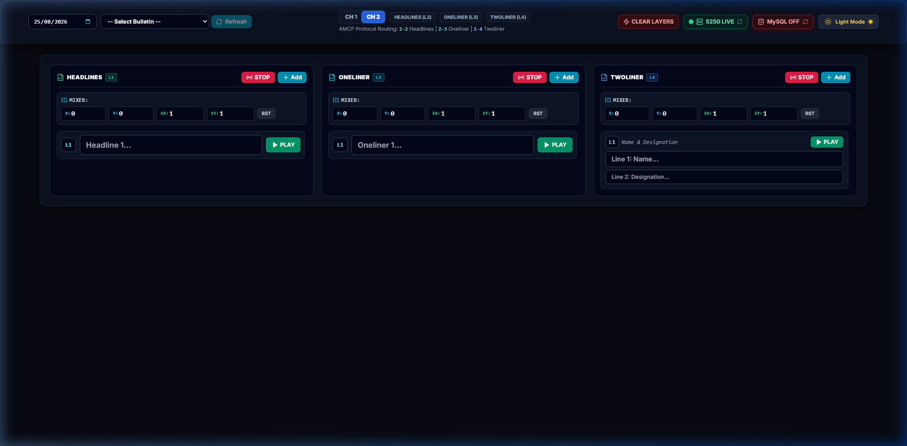

# NHBS — Newsroom Headlines & Graphics Playout Studio



A professional, high-performance Next.js application designed as a live **Newsroom Control System (NRCS) Graphics Client** for **CasparCG Broadcast Server** connected to a **MySQL NRCS Database (`nrcsnew`)**.

Built for television broadcast operators, newsroom directors, and MCR engineers, this application provides instant database-driven graphics playout, multi-layer routing, 2-line lower third graphics, and real-time live AMCP Mixer positioning & scaling controls.

---

## 🌟 Key Features & Architecture

### 🎛️ 1. Master Top Row Control Bar
- **Leftmost Broadcast Date & News Bulletin Selectors**: Instant date selection and bulletin dropdown with a real-time **Refresh** button.
- **Interactive Channel Number Switcher (`CH 1` / `CH 2`)**: Toggle between playout channels on the fly with live dynamic protocol routing updates (`1-2` or `2-2`).
- **Live On-Air Layer 2 Badge**: Active pulse indicator for **ON AIR (L2)** / **STANDBY (L2)**.
- **Single Master STOP Button**: Centrally located master STOP button to instantly take off any graphics on Layer 2.
- **Layer Clear (`CLEAR L2`)**: Stops and clears Layer 2 on the selected channel, leaving other channel media completely untouched.
- **Server Telemetry Badges**: Real-time heartbeat indicators for CasparCG Server TCP socket (`5250 LIVE` / `SIMULATION`) and MySQL Database connection (`MySQL LIVE` / `MySQL OFF`).
- **Animated Dark / Light Mode Switcher**: Smooth theme transitions with zero-flash pre-hydration.

---

### 📰 2. 3-Column Parallel Newsroom Data Explorer
- **High-Legibility Broadcast Typography**: Enlarged data input fields (`16px bold` for headlines and oneliners, `14px/12px bold` for twoliners, `14px mono` for mixer coordinates) tailored for studio monitors.
- **HEADLINES (Layer 2)**:
  - Queries records with `SlugName = 'headlines'`.
  - Routes playout directly to **Channel X — Layer 2 (`X-2`)**.
  - Template: `http://127.0.0.1:22000/templates/headlines` (Custom transparent overlay).
- **ONELINER (Layer 2)**:
  - Queries records with `SlugName = 'oneliner'`.
  - Routes playout directly to **Channel X — Layer 2 (`X-2`)**.
  - Template: `http://127.0.0.1:22000/templates/oneliner` (Dark glassmorphism background strip bar).
- **TWOLINER (Layer 2)**:
  - Queries records with `SlugName = 'twoliner'`.
  - Automatically parses `Name $$$$ Designation` format into stacked Line 1 (Name) & Line 2 (Designation) editable fields.
  - Routes playout directly to **Channel X — Layer 2 (`X-2`)**.
  - Template: `http://127.0.0.1:22000/templates/twoliner` (2-line animated lower third strip).

---

### 📐 3. Real-Time Live AMCP Mixer Controls
- **Individual 4-DOF Layer Manipulation** for each graphic type on Layer 2:
  - **Headlines Mixer**: Independent X, Y, SX, SY controls for Headlines.
  - **Oneliner Mixer**: Independent X, Y, SX, SY controls for Oneliner.
  - **Twoliner Mixer**: Independent X, Y, SX, SY controls for Twoliner.
  - **Live Real-Time Execution**: Adjusting numeric values automatically dispatches AMCP commands live on air:
    ```amcp
    MIXER 1-2 FILL 0.05 -0.02 0.95 0.95
    ```
  - **RST Button**: Instantly resets the specific graphic type's transform and issues `MIXER X-2 CLEAR`.

---

### 💾 4. Complete `localStorage` State Persistence
All operator settings persist across browser restarts and page refreshes:
- Selected Broadcast Date (`casparcg_selected_date`)
- Selected News Bulletin (`casparcg_selected_bulletin`)
- Active Channel Selection (`casparcg_selected_channel`)
- 4-DOF Layer Mixer Transforms (`casparcg_mixer_pos`)
- UI Theme Mode (`casparcg_theme`)

---

### 🎨 5. Broadcast Alpha Fill & Key HTML Templates
- Fully transparent HTML alpha canvas (`1920x1080`) optimized for CasparCG SDI / NDI fill & key output.
- Smooth CSS animations, clean typography, glassmorphism aesthetics, and native CasparCG HTML Template API (`window.play()`, `window.stop()`, `window.update()`).

---

## 🛠️ Hardware & Software Requirements

- **Node.js**: v18.0 or higher
- **CasparCG Server**: 2.3.x or 2.4.x (running HTML Producer enabled)
- **MySQL Database**: v8.0 or MariaDB (Database: `nrcsnew`, Table: `Script`)

---

## 🚀 Quick Start Guide

### 1. Clone & Install Dependencies
```bash
git clone https://github.com/vimlesh1975/nhbs.git
cd nhbs
npm install
```

### 2. Configure Environment Variables (`.env.local`)
Create `.env.local` in the project root:
```env
# CasparCG Server Configuration
CASPARCG_HOST=127.0.0.1
CASPARCG_PORT=5250

# MySQL NRCS Database Credentials
DB_HOST=127.0.0.1
DB_PORT=3306
DB_USER=itmaint
DB_PASSWORD=itddkchn
DB_NAME=nrcsnew
```

### 3. Database Schema Overview
The system queries the `Script` table:
```sql
SELECT Script FROM Script 
WHERE bulletinname = '0830' 
  AND LOWER(SlugName) = LOWER('headlines') 
  AND DATE(bulletindate) = '2026-08-22' 
ORDER BY id DESC;
```
For 2-line graphics, format text in MySQL with the `$$$$` delimiter:
```
Dr. Sarah Jenkins $$$$ Chief AI Scientist
```

### 4. Start Next.js Development Server
```bash
npm run dev
```
Open **[http://localhost:22000](http://localhost:22000)** in your web browser.

---

## ⚙️ Windows PM2 Process Manager Setup

The project is fully configured for zero-downtime execution with **PM2** on Windows Server / Windows 10/11.

### 1. Install PM2 Globally (One-time)
```bash
npm install -g pm2
```

### 2. Run via Single-Click Windows Batch Files
- **`start_pm2.bat`**: Builds the production bundle and launches NHBS Studio via PM2 in the background.
- **`restart_pm2.bat`**: Restarts the PM2 process without downtime.
- **`stop_pm2.bat`**: Safely stops and deregisters the PM2 background process.

### 3. NPM PM2 CLI Commands
```bash
# Build and start with PM2
npm run build
npm run pm2:start

# Check live process telemetry
npx pm2 status

# View live broadcast logs
npm run pm2:logs

# Restart or stop the server
npm run pm2:restart
npm run pm2:stop
```

### 4. Auto-Start on Windows Boot (Optional Service)
To automatically launch the server whenever Windows boots:
```bash
npm install -g pm2-windows-startup
pm2-startup install
pm2 save
```

---

## 📡 CasparCG AMCP Command Syntax Reference

This client communicates over TCP socket (`5250`) using standard AMCP commands:

```amcp
# Headlines (Layer 2)
CG 1-2 ADD 1 "http://127.0.0.1:22000/templates/headlines?f0=Headline%20Text" 1 "{\"f0\":\"Headline Text\"}"
CG 1-2 STOP 1

# Oneliner (Layer 3)
CG 1-3 ADD 1 "http://127.0.0.1:22000/templates/oneliner?f0=Oneliner%20Text" 1 "{\"f0\":\"Oneliner Text\"}"
CG 1-3 STOP 1

# Twoliner (Layer 4)
CG 1-4 ADD 1 "http://127.0.0.1:22000/templates/twoliner?f0=Name&f1=Designation" 1 "{\"f0\":\"Name\",\"f1\":\"Designation\"}"
CG 1-4 STOP 1

# Real-Time Layer Mixer Positioning
MIXER 1-2 FILL 0.05 0 0.9 0.9
MIXER 1-2 CLEAR
```

---

## 📁 Repository Structure

```
nhbs/
├── app/
│   ├── api/
│   │   ├── casparcg/        # AMCP TCP socket bridge route handler
│   │   └── db/              # MySQL script and bulletin query APIs
│   ├── templates/
│   │   ├── headlines/       # Headlines single-line overlay template
│   │   ├── oneliner/        # Dark glassmorphism strip template
│   │   └── twoliner/        # 2-line Name & Designation graphic template
│   ├── globals.css          # Broadcast CSS & Dark/Light mode styles
│   ├── layout.js            # Root layout with theme anti-flicker script
│   └── page.js              # Master Playout Controller
├── components/
│   ├── Header.jsx           # Top master toolbar (Date, Bulletin, CH Switcher, Status)
│   ├── DatabaseExplorer.jsx # 3-Column script data deck with Mixer controls
│   ├── ThemeToggle.jsx      # Animated Dark / Light theme switch
│   └── LivePreviewModal.jsx # Web graphics preview modal
├── public/
│   └── screenshot.png       # Application UI screenshot
└── package.json
```

---

## 📜 License
MIT License. Built for broadcast graphics workflows.
